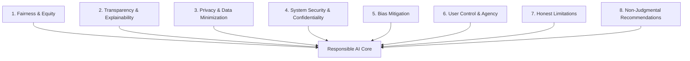

# 🛡️ Responsible AI, Privacy & Ethics Framework
**Document ID:** 05_Responsible_AI_Framework  
**Governance Scope:** Algorithmic Fairness, Data Protection, LLM Grounding & User Agency  
**Compliance Standards:** UNESCO Recommendation on AI Ethics, OECD AI Principles, ISO/IEC 42001

---

## 1. Principles of Responsible Water AI
The **Smart Water Usage Advisor** processes sensitive domestic and institutional consumption telemetry and delivers automated recommendations via conversational AI. To protect user trust, privacy, and well-being, this framework establishes eight mandatory ethical pillars:

---

## 2. Detailed Governance Specifications

### 2.1 Fairness & Equity
- **Socioeconomic Neutrality:** High water consumption must not be blindly equated with "wastefulness." Large households, families with infant care, medical conditions, or aging plumbing infrastructure must not be penalized or shamed.
- **Fair Baseline Comparisons:** When computing peer benchmarking (e.g., "Compared to similar households"), normalizations **must** factor in household occupancy, property square footage, and seasonal climate conditions, rather than comparing gross volumes.

### 2.2 Transparency & Explainability
- **Forecasting Explainability:** The system will never present a forecast without articulating its primary drivers (e.g., *"This week's forecast is 12% higher due to anticipated 32°C weekend heat and your historical Saturday lawn irrigation schedule"*).
- **Leak Alert Clarity:** Anomaly notifications must transparently explain the statistical rationale (e.g., *"Continuous flow of 18 L/hr detected across 4 consecutive hours between 01:00 and 05:00 AM"*).
- **Chatbot AI Disclosure:** The system explicitly notifies users that they are interacting with an artificial intelligence assistant, not a licensed plumber or municipal billing officer.

### 2.3 Privacy & Data Minimization
- **Aggregation by Default:** The application stores consumption data aggregated to 1-hour intervals, avoiding ultra-high-frequency (second-level) signatures that can reveal occupant movement and sleep routines.
- **Data Segregation:** Personally Identifiable Information (name, email, billing address) is stored in the `users` table and decoupled from raw meter telemetry in `water_usage_data`.
- **Telemetry Retention:** Historical granular telemetry is purged or down-sampled to daily summaries after 365 days unless explicitly retained by user preference.

### 2.4 Security & Data Protection
- **No Hard-Coded Credentials:** All database passwords, tokens, and API keys are strictly injected via environment variables (`.env`).
- **Role-Based Access Control (RBAC):** Users can only query their own meters, usage logs, and alerts. Municipal users have access only to anonymized district-level aggregates.
- **Transport Encryption:** All API communications require TLS 1.3 encryption in transit.

### 2.5 Bias Auditing & Mitigation
- **Algorithmic Bias Sources:** ML models trained predominantly on modern suburban homes with efficient fixtures may misclassify older urban apartments with legacy plumbing as perpetually "anomalous."
- **Audit Mandate (Phase 5):** The test suite includes demographic and architectural stress tests to ensure anomaly detection sensitivity remains consistent across single-occupant apartments, multi-family dwellings, and large commercial spaces.

### 2.6 User Control & Agency
- **Opt-Out & Telemetry Pause:** Users can pause data logging or delete their account and associated historical records at any time ("Right to be Forgotten").
- **Alert Frequency Management:** Users can tune alert sensitivity (e.g., disable minor flow notifications while maintaining critical burst pipe alerts) to prevent notification fatigue.
- **Non-Automated Interventions:** The AI Advisor provides recommendations and diagnostics, but never takes physical control of valves or utility accounts without human confirmation.

### 2.7 Honesty Regarding Technical Limitations
- **No Hallucinated Data:** If meter data is missing or interrupted, the system must clearly display *"Data Unavailable"* rather than generating synthetic fills without user notification.
- **Chatbot Humility:** The conversational LLM is explicitly instructed in system prompts: *"If you are unsure of the cause of a water anomaly, acknowledge uncertainty and advise a manual inspection of the meter or consultation with a certified technician."*

### 2.8 Responsible Recommendation Design
- **Supportive, Non-Judgmental Tone:** Language must remain encouraging, constructive, and sustainability-focused. Terms like *"guilty," "careless,"* or *"excessive waste"* are banned from chatbot prompts.
- **Practical & Cost-Effective Interventions:** Recommendations must balance behavioral adjustments (e.g., timing garden watering) with realistic hardware advice (e.g., checking toilet flapper seals for under \$10), avoiding unrealistic demands for immediate whole-property replumbing.
