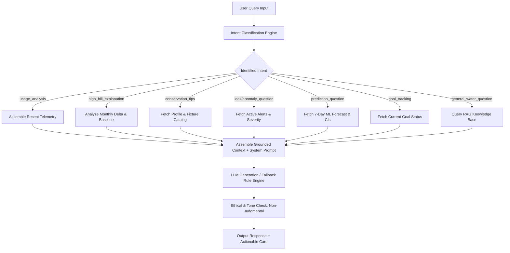

# 💬 Chatbot Conversation Architecture & Intent Flows
**Document ID:** Chatbot_Conversation_Flow  
**Directory:** 3_DESIGN/design_documents/  
**Status:** Phase 1 Conversational Design Specification  
**Governing Rule:** No direct LLM API connection during Phase 1.

---

## 1. Core Conversational Architecture
The **Smart Water Usage Advisor Chatbot** acts as an empathetic, expert conversational assistant. It leverages a multi-stage conversational pipeline:
1. **User Query Ingestion:** Sanitizes and parses incoming message.
2. **Intent Classification:** Classifies query into one of 7 standardized domain intents.
3. **Context Assembly (RAG):** Dynamically injects:
   - User Profile: Occupancy, property type, fixture counts (`user_profiles`).
   - Telemetry Snapshot: Today's usage, 7-day average, active anomalies (`water_usage_data`, `anomalies`).
   - Domain Knowledge: Curated conservation advice snippets (`rag_knowledge_base.json`).
4. **Prompt Generation:** Formulates prompt using grounded system prompt templates.
5. **Response Generation:** Generates non-judgmental, grounded guidance (<2s target latency).

---

## 2. Intent Specifications & Conversation Trees

### Intent 1: `usage_analysis`
- **User Utterance Examples:** *"How much water did I use yesterday?"*, *"What's my biggest water consumer?"*, *"Show my usage breakdown."*
- **Context Required:** Sum of `consumption_liters` grouped by `category_name` for the requested timeframe.
- **Bot Behavior:** Summarizes volume in liters and percentage share. Highlights top consuming category with positive reinforcement.

### Intent 2: `high_bill_explanation`
- **User Utterance Examples:** *"Why is my water bill so high this month?"*, *"My bill jumped by $40, why?"*
- **Context Required:** Current month total vs. 3-month rolling baseline, temperature anomaly data, detected leaks during billing cycle.
- **Bot Behavior:** Decomposes the increase objectively (e.g., *"Your bill is 22% higher primarily due to: 1) A 4-day continuous leak detected on the 12th (~3,200 L), and 2) Three lawn watering sessions during the heatwave"*). Avoids accusing the user.

### Intent 3: `conservation_tips`
- **User Utterance Examples:** *"How can I save water in the bathroom?"*, *"Tips to reduce garden watering?"*
- **Context Required:** User property type, garden square footage, and fixture inventory.
- **Bot Behavior:** Retrieves high-impact tips tailored to user's specific fixtures, quoting estimated liter and dollar savings.

### Intent 4: `leak/anomaly_question`
- **User Utterance Examples:** *"The dashboard says I have a leak, what should I do?"*, *"Why is there an alert on my account?"*
- **Context Required:** Most recent active record from `alerts` and `anomalies`.
- **Bot Behavior:** Explains the time, duration, and rate of the anomaly. Provides a prioritized diagnostic checklist (e.g., food-coloring toilet test, irrigation valve inspection).

### Intent 5: `prediction_question`
- **User Utterance Examples:** *"How much water will I use this week?"*, *"Will I exceed my monthly budget?"*
- **Context Required:** `predictions` table entries for target meter over next 7 days.
- **Bot Behavior:** Reports expected daily average and confidence intervals. Identifies days with anticipated spikes.

### Intent 6: `goal_tracking`
- **User Utterance Examples:** *"Am I on track for my 20% savings goal?"*, *"How close am I to my monthly target?"*
- **Context Required:** `goals` table entry and percentage progress.
- **Bot Behavior:** Encouraging status update with remaining allowable liters for the billing period.

### Intent 7: `general_water_question`
- **User Utterance Examples:** *"What is SDG 6?"*, *"How much water does an average person use per day?"*
- **Context Required:** Static entries from `rag_knowledge_base.json`.
- **Bot Behavior:** Educational, concise explanations grounded in WHO and EPA WaterSense standards.

---

## 3. Conversational Safety & Tone Rules
1. **Never Blame or Shame:** Frame all consumption neutrally (e.g., *"We observed higher consumption"* instead of *"You were careless"*).
2. **Honesty Regarding Uncertainty:** If telemetry cannot isolate an anomaly cause, state: *"The meter data indicates continuous flow, but cannot distinguish between a running hose and an internal pipe leak. We recommend checking these three fixtures first."*
3. **No Hallucinated Data:** If meter data is missing, admit lack of data rather than guessing numbers.
